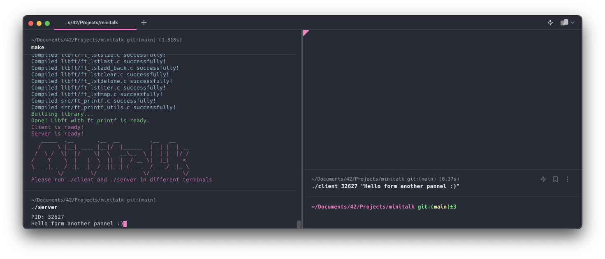

# Minitalk 💬



Welcome to Minitalk. Minitalk is a simple yet powerful communication system, enabling message exchange between processes using UNIX signals. The goal of this project is to create a reliable and efficient communication channel. As an added bonus, it's incredibly fun! 🎉

## How it works 🕹️

Minitalk uses two custom programs written in C - a server and a client. The server is capable of receiving and interpreting signals sent from the client. Each character sent by the client is converted to a binary format, then sent bit by bit to the server using UNIX signals `SIGUSR1` and `SIGUSR2`. After receiving a full byte (8 bits), the server converts these bits back to a character and prints it. Voilà! We have communication! 📡

## How to use it 🚀

1. Clone the repository to your local machine.
```
git clone https://github.com/Awis13/minitalk.git
```
2. Compile both server and client using the Makefile provided.
```
make
```
3. First, run the server program. It will print out its PID.
```
./server
```
4. Open a new terminal, then run the client program with the server's PID and the string you want to send as arguments.
```
./client <server_pid> <string>
```

Voilà! The server will receive and print your string one character at a time. Cool, right? 🎈

